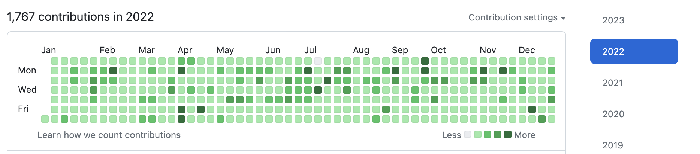
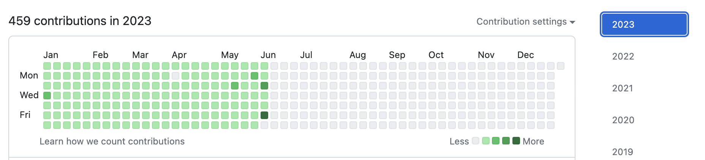

## このリポジトリは？
[Scala関数型デザイン&プログラミング ―Scalazコントリビューターによる関数型徹底ガイド (impress top gear)](https://www.amazon.co.jp/dp/4844337769/) の学習記録

## 学んだこと
- Scalaの基本的な書き方
- 関数型プログラミングの基礎的な考え方
  - データ構造
  - 例外を使わないエラー処理
  - 純粋関数
- 関数型のデザイン
  - [モノイド](./src/test/scala/fpinscala/monoids/MonoidTest.scala)
  - ファンクタ
  - モナド
  - [アプリカティブファンクタ](./src/main/scala/fpinscala/monoids/Applicative.scala)
- I/Oがある場合の関数型の実装

## 感想
- 一通り書いてみてScalaの書き方については学べたと思う
- 関数型プログラミングで目指している物については少しだけ理解が進んだ
- 難しそうだと思っていたモナドやアプリカティブも多少はわかった（多少な・・・）
- とはいえ、実現したいことに対する(学習)コストが気になる今日この頃である
- 使いこなせるかどうかで言うとまだまだかな

## 思い出
毎日コツコツとコミットしていき草がきれいに生えました

### 2022年

- 選挙の日にうっかりコミットし忘れて悔しい思いをした

### 2023年

- またコミットを一日だけ忘れた
- 選挙の日ではないが6日後に選挙があったので「きっと選挙のせい」と思うことにした
